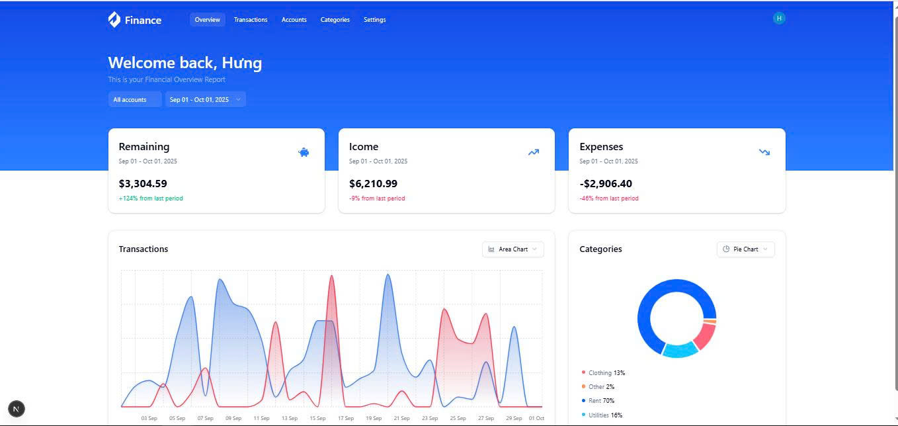
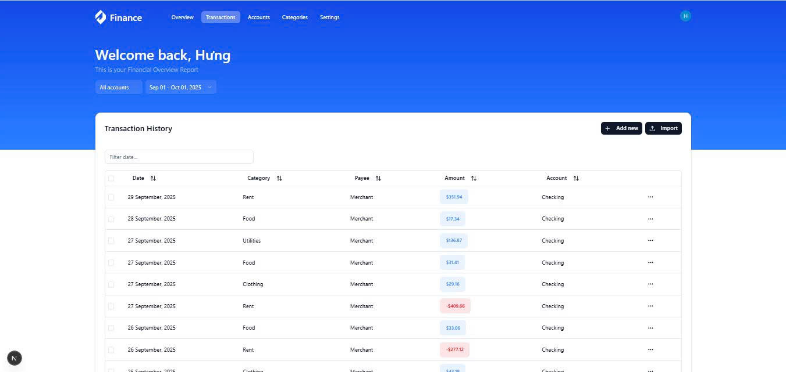

This is a [Next.js](https://nextjs.org) project bootstrapped with [`create-next-app`](https://nextjs.org/docs/app/api-reference/cli/create-next-app).

## Getting Started

First, run the development server:

```bash
npm run dev
# or
yarn dev
# or
pnpm dev
# or
bun dev
```

Open [http://localhost:3000](http://localhost:3000) with your browser to see the result.

You can start editing the page by modifying `app/page.tsx`. The page auto-updates as you edit the file.

This project uses [`next/font`](https://nextjs.org/docs/app/building-your-application/optimizing/fonts) to automatically optimize and load [Geist](https://vercel.com/font), a new font family for Vercel.

## Project Overview

Finance Tracker is a modern web application built with [Next.js](https://nextjs.org) for managing personal finances. It allows users to track transactions, categorize expenses, manage accounts, and visualize financial data with interactive charts.

### Features

- Dashboard with financial overview and charts
- Transaction management (add, edit, delete, import)
- Account and category management
- Data filtering by account and date range
- Responsive design for desktop and mobile
- Authentication with Clerk
- Custom UI components for consistent design
- API routes powered by Hono
- Database schema managed with Drizzle ORM

### Screenshots

<!-- Add screenshots of your app here -->



### Tech Stack

- Next.js
- React
- TypeScript
- Clerk (authentication)
- Drizzle ORM (database)
- Tailwind CSS
- React Query
- Hono (API routing)
- Custom UI components (`components/ui`)

### Getting Started

Follow the instructions below to run the project locally.

## Learn More

To learn more about Next.js, take a look at the following resources:

- [Next.js Documentation](https://nextjs.org/docs) - learn about Next.js features and API.
- [Learn Next.js](https://nextjs.org/learn) - an interactive Next.js tutorial.

You can check out [the Next.js GitHub repository](https://github.com/vercel/next.js) - your feedback and contributions are welcome!

## Deploy on Vercel

The easiest way to deploy your Next.js app is to use the [Vercel Platform](https://vercel.com/new?utm_medium=default-template&filter=next.js&utm_source=create-next-app&utm_campaign=create-next-app-readme) from the creators of Next.js.

Check out our [Next.js deployment documentation](https://nextjs.org/docs/app/building-your-application/deploying) for more details.

## UI Components

Many files in the `components/ui` folder are sourced from popular UI libraries to provide a consistent and modern design.  
Custom components that I developed specifically for this project are placed in the main `components` folder.

This structure helps separate third-party UI elements from custom-built features, making the codebase easier to maintain and extend.
